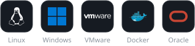
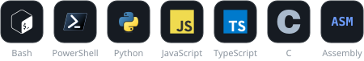
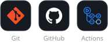

 

I keep infrastructure running and try to make it run itself — containerized services, monitoring, and scripts that replace repetitive manual work. Based in France 🇫🇷

 

### Toolbox

  <b>Systems &amp; infrastructure</b> 
  

  <b>Languages</b> 
  

  <b>Tooling &amp; CI</b> 
  

 
 

### Projects

<table>
  <tr>
    <td width="50%" valign="top">
      <h4>🟢 <a href="https://github.com/50bvd/mmi3g-green-menu-activator">MMI 3G Green Menu</a></h4>
      Enables the hidden Green Engineering Menu on Audi MMI 3G units from an SD card, with verified backups and a one-file rollback.
    </td>
    <td width="50%" valign="top">
      <h4>🖥️ <a href="https://github.com/50bvd/jekyll-infops-theme">jekyll-infops-theme</a></h4>
      Jekyll theme for DevOps &amp; SysOps blogs: CRT-style terminal, dark/light mode, search and Docker-ready setup.
    </td>
  </tr>
  <tr>
    <td width="50%" valign="top">
      <h4>🔐 <a href="https://github.com/50bvd/clipboardfilter">ClipboardFilter</a></h4>
      Secure clipboard filtering tool working across multiple systems.
    </td>
    <td width="50%" valign="top">
      <h4>🔑 <a href="https://github.com/50bvd/kmsact">KMSAct</a></h4>
      Windows / Office activation tool.
    </td>
  </tr>
</table>

 

### Languages

<picture>
  <source media="(prefers-color-scheme: dark)" srcset="https://raw.githubusercontent.com/50bvd/50bvd/main/languages-chart.svg" />
  <source media="(prefers-color-scheme: light)" srcset="https://raw.githubusercontent.com/50bvd/50bvd/main/languages-chart-light.svg" />
  
</picture>

<b>More GitHub metrics</b>

 

